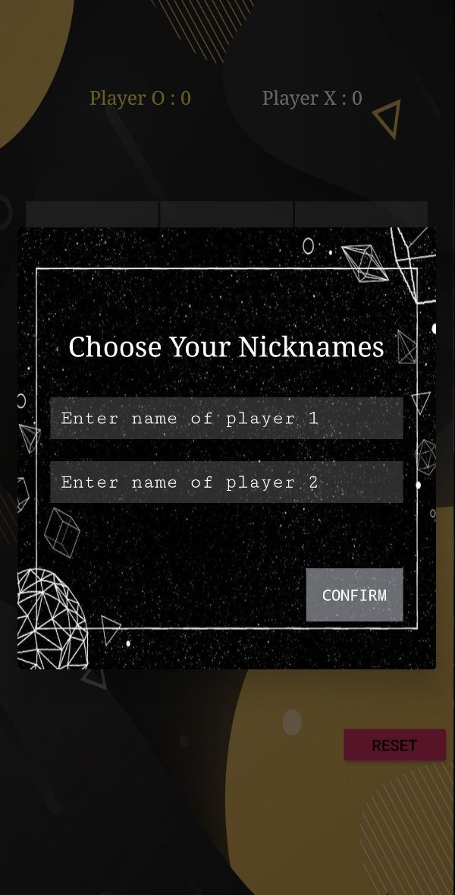
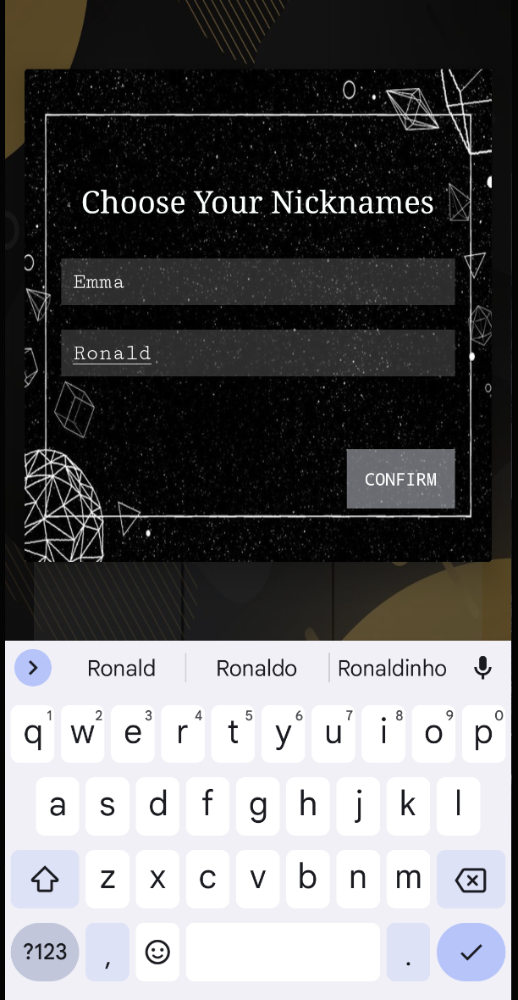
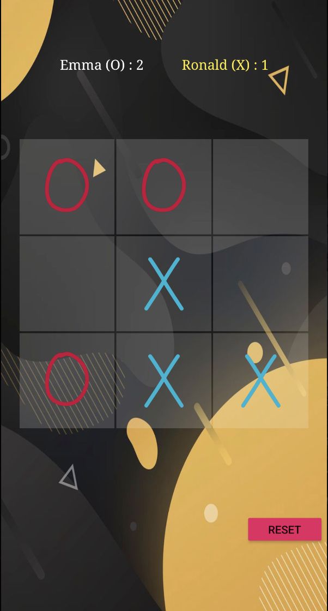
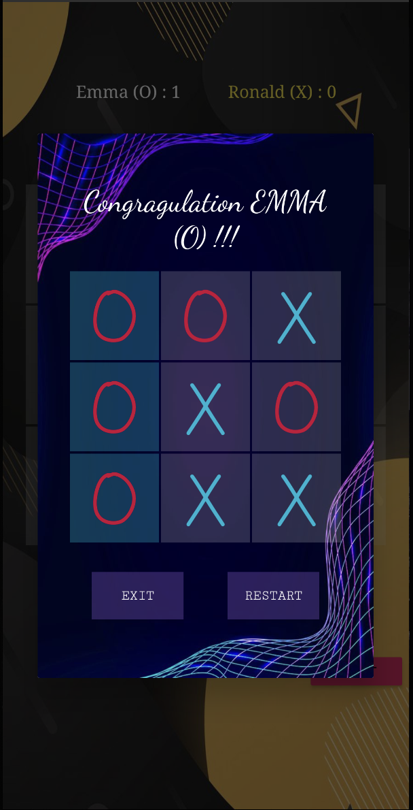
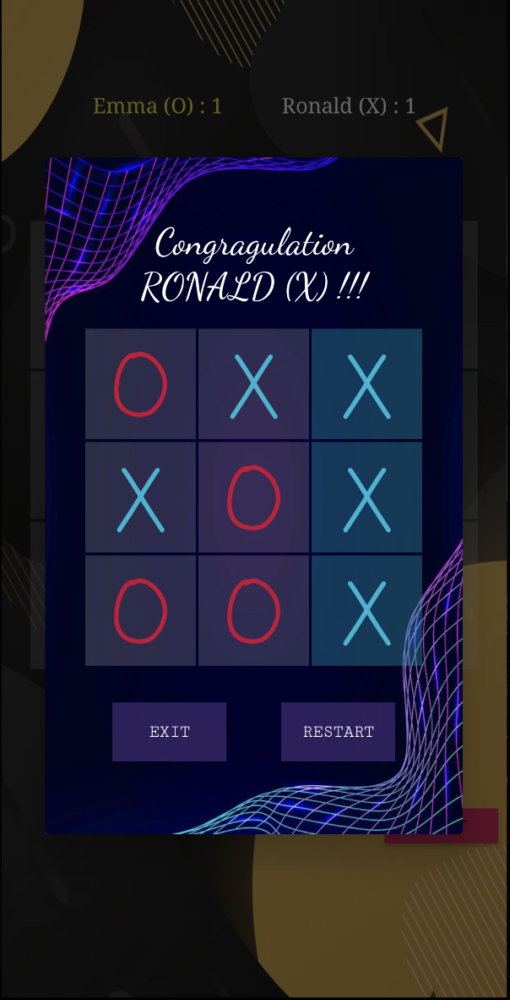
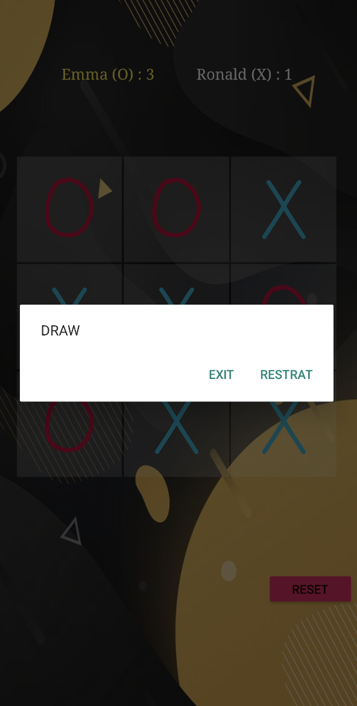

# 🎮 Tic Tac Toe Android Game

A simple and fun **Tic Tac Toe** Android game built in Java using Android Studio.  
Two players can enter their names, take turns playing, and enjoy playing. 

---

##  Game Flow

###  1. Main Page
The start screen features a **Play** button to begin the game.

  

---

### 2. Enter Player Names
Before the game starts, a dialog asks both players to enter their names.

| Name Prompt | Entering Names |
|:------------:|:---------------:|
|  |  |
---

### 3. Playing the Game
Players take turns marking **O** and **X** on the grid.  
- **O** is red (first player)  
- **X** is blue (second player)  
The score and turn indicator update dynamically.

  

---

###  4. End States
At the end of each round, one of the following dialogs appears:

####  Game Results

| O Wins | X Wins | Draw |
|:------:|:------:|:----:|
|  |  |  |

---

✨ **Enjoy playing Tic Tac Toe with your friends!**

## Installation

1. Clone the repository to your local machine.
2. Open the project in Android Studio.
3. Build and run the project on an Android emulator or a physical Android device.

